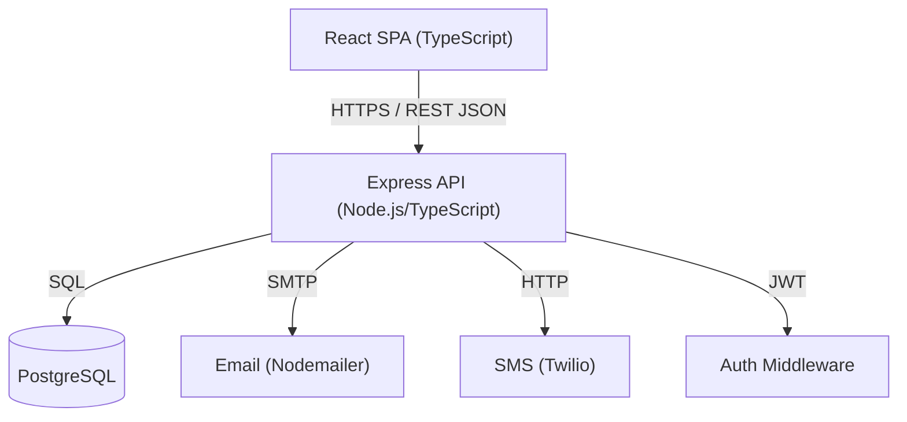

# Design Document

## Smart Shop Inventory Management System (SSIMS)

---

## Overview

SSIMS is a web-based inventory management application for shopkeepers. It provides product catalog management, stock level monitoring, expiry date tracking, physical location tracking, alerting, a dashboard overview, and reporting/analytics.

The system follows a client-server architecture: a React/TypeScript single-page application communicates with a Node.js/Express/TypeScript REST API backed by a PostgreSQL database. JWT-based authentication secures all protected endpoints. Optional SMS/Email notifications are delivered via Twilio and Nodemailer respectively.

Key design goals:
- Pure functions for status derivation (stock status, expiry status) to enable straightforward property-based testing
- Alert generation as a side-effect of product/stock mutations, keeping alert logic centralized
- Settings stored per-shopkeeper to support configurable near-expiry windows and notification channels
- All stock changes recorded as immutable movements to support audit trails and reporting

---

## Architecture



### Layer Responsibilities

- **Frontend (React/TypeScript)**: Renders UI, manages local state via React Query, handles form validation with Zod, redirects unauthenticated users via AuthGuard.
- **API (Express/TypeScript)**: Validates requests with Zod, enforces JWT auth middleware, executes business logic, persists data, triggers alert evaluation and notifications.
- **Database (PostgreSQL)**: Stores all persistent state. Uses indexes for search performance (pg_trgm for full-text search).
- **Notification Adapters**: Pluggable interface with Email and SMS implementations; retry logic lives in the notification service layer.

---

## Components and Interfaces

### REST API Endpoints

#### Authentication
| Method | Path | Description |
|--------|------|-------------|
| POST | /auth/login | Validate credentials, issue JWT access + refresh tokens, log event |
| POST | /auth/refresh | Exchange refresh token for new access token |
| POST | /auth/logout | Revoke refresh token |

#### Categories
| Method | Path | Description |
|--------|------|-------------|
| GET | /categories | List all categories |
| POST | /categories | Create category |
| PUT | /categories/:id | Rename category |
| DELETE | /categories/:id | Delete category (409 if products exist) |

#### Products
| Method | Path | Description |
|--------|------|-------------|
| GET | /products | List products with search/filter params |
| POST | /products | Create product |
| GET | /products/:id | Get single product |
| PUT | /products/:id | Update product |
| DELETE | /products/:id | Delete product |
| POST | /products/:id/stock | Record stock addition or reduction |

#### Alerts
| Method | Path | Description |
|--------|------|-------------|
| GET | /alerts | List active (unacknowledged) alerts |
| PUT | /alerts/:id/acknowledge | Acknowledge alert |

#### Dashboard
| Method | Path | Description |
|--------|------|-------------|
| GET | /dashboard | Return inventory summary counts and active alerts |

#### Settings
| Method | Path | Description |
|--------|------|-------------|
| GET | /settings | Get shopkeeper settings |
| PUT | /settings | Update settings |

#### Reports
| Method | Path | Description |
|--------|------|-------------|
| GET | /reports/stock-usage | Stock usage trend over date range |
| GET | /reports/expiry-wastage | Expiry wastage over date range |
| GET | /reports/top-restocked | Top 10 most restocked products |
| GET | /reports/:type/csv | Export report as CSV |

### Core Pure Functions

```typescript
// Derives stock classification from quantity and threshold
function deriveStockStatus(
  quantity: number,
  threshold: number | null
): "In Stock" | "Low Stock" | "Out of Stock"

// Derives expiry classification from expiry date and window
function deriveExpiryStatus(
  expiryDate: Date | null,
  nearExpiryWindowDays: number,
  now?: Date
): "Valid" | "Near Expiry" | "Expired" | null
```

### Alert Evaluation Service

Called after every product create/update and stock movement:

```typescript
async function evaluateAndGenerateAlerts(productId: string, db: Database): Promise<void>
```

Compares current derived statuses against the last known statuses and inserts new alert records for any transitions to "Low Stock", "Out of Stock", "Near Expiry", or "Expired".

### Notification Service

```typescript
interface NotificationAdapter {
  send(to: string, subject: string, body: string): Promise<void>
}

class NotificationService {
  async notify(alert: Alert, settings: Settings): Promise<void>
  // Retries up to 3 times with exponential backoff (1s, 2s, 4s)
}
```

---

## Data Models

### Database Schema

```sql
-- Users
CREATE TABLE users (
  id UUID PRIMARY KEY DEFAULT gen_random_uuid(),
  username TEXT UNIQUE NOT NULL,
  password_hash TEXT NOT NULL,
  email TEXT,
  phone TEXT,
  created_at TIMESTAMPTZ DEFAULT now()
);

-- Refresh tokens
CREATE TABLE refresh_tokens (
  id UUID PRIMARY KEY DEFAULT gen_random_uuid(),
  user_id UUID REFERENCES users(id) ON DELETE CASCADE,
  token_hash TEXT NOT NULL,
  expires_at TIMESTAMPTZ NOT NULL,
  revoked_at TIMESTAMPTZ
);

-- Auth events
CREATE TABLE auth_events (
  id UUID PRIMARY KEY DEFAULT gen_random_uuid(),
  user_id UUID REFERENCES users(id) ON DELETE SET NULL,
  event_type TEXT NOT NULL, -- 'login_success' | 'login_failure' | 'session_expiry'
  ip_address TEXT,
  occurred_at TIMESTAMPTZ DEFAULT now()
);

-- Categories
CREATE TABLE categories (
  id UUID PRIMARY KEY DEFAULT gen_random_uuid(),
  name TEXT UNIQUE NOT NULL,
  created_at TIMESTAMPTZ DEFAULT now()
);

-- Products
CREATE TABLE products (
  id UUID PRIMARY KEY DEFAULT gen_random_uuid(),
  name TEXT NOT NULL,
  category_id UUID REFERENCES categories(id),
  quantity INTEGER NOT NULL DEFAULT 0,
  minimum_threshold INTEGER,
  expiry_date DATE,
  rack TEXT,
  shelf TEXT,
  section TEXT,
  created_at TIMESTAMPTZ DEFAULT now(),
  updated_at TIMESTAMPTZ DEFAULT now()
);

-- Full-text search index
CREATE INDEX products_name_trgm ON products USING gin(name gin_trgm_ops);

-- Stock movements (immutable audit log)
CREATE TABLE stock_movements (
  id UUID PRIMARY KEY DEFAULT gen_random_uuid(),
  product_id UUID REFERENCES products(id) ON DELETE CASCADE,
  delta INTEGER NOT NULL, -- positive = addition, negative = reduction
  quantity_after INTEGER NOT NULL,
  recorded_at TIMESTAMPTZ DEFAULT now()
);

-- Alerts
CREATE TABLE alerts (
  id UUID PRIMARY KEY DEFAULT gen_random_uuid(),
  product_id UUID REFERENCES products(id) ON DELETE CASCADE,
  alert_type TEXT NOT NULL, -- 'low_stock' | 'out_of_stock' | 'near_expiry' | 'expired'
  generated_at TIMESTAMPTZ DEFAULT now(),
  acknowledged_at TIMESTAMPTZ
);

-- Settings (one row per user)
CREATE TABLE settings (
  user_id UUID PRIMARY KEY REFERENCES users(id) ON DELETE CASCADE,
  near_expiry_window_days INTEGER NOT NULL DEFAULT 30,
  email_notifications_enabled BOOLEAN NOT NULL DEFAULT false,
  sms_notifications_enabled BOOLEAN NOT NULL DEFAULT false
);
```

### TypeScript Types

```typescript
type StockStatus = "In Stock" | "Low Stock" | "Out of Stock";
type ExpiryStatus = "Valid" | "Near Expiry" | "Expired";
type AlertType = "low_stock" | "out_of_stock" | "near_expiry" | "expired";

interface Product {
  id: string;
  name: string;
  categoryId: string;
  categoryName: string; // joined
  quantity: number;
  minimumThreshold: number | null;
  expiryDate: string | null; // ISO date
  rack: string | null;
  shelf: string | null;
  section: string | null;
  stockStatus: StockStatus;   // derived
  expiryStatus: ExpiryStatus | null; // derived, null if no expiry date
  createdAt: string;
  updatedAt: string;
}

interface Alert {
  id: string;
  productId: string;
  productName: string; // joined
  alertType: AlertType;
  generatedAt: string;
  acknowledgedAt: string | null;
}

interface DashboardResponse {
  totalProducts: number;
  lowStockCount: number;
  outOfStockCount: number;
  nearExpiryCount: number;
  expiredCount: number;
  activeAlerts: Alert[];
}

interface Settings {
  nearExpiryWindowDays: number;
  emailNotificationsEnabled: boolean;
  smsNotificationsEnabled: boolean;
}
```

---

## Correctness Properties

*A property is a characteristic or behavior that should hold true across all valid executions of a system — essentially, a formal statement about what the system should do. Properties serve as the bridge between human-readable specifications and machine-verifiable correctness guarantees.*

### Property 1: Unauthenticated requests are rejected

*For any* protected API endpoint and any request that does not carry a valid JWT access token, the system should return a 401 Unauthorized response.

**Validates: Requirements 1.1, 12.2**

---

### Property 2: Invalid credentials are denied

*For any* username/password pair that does not match a registered user's credentials, the login endpoint should return an error response and not issue any tokens.

**Validates: Requirements 1.3**

---

### Property 3: Password hashes are unique per user

*For any* two users created with the same plaintext password, their stored password hashes should be different (demonstrating unique salts), and neither hash should equal the plaintext password.

**Validates: Requirements 1.5**

---

### Property 4: Product creation round-trip

*For any* valid product payload (name, category, quantity, location), creating the product and then fetching it by the returned ID should yield a record containing all the submitted fields.

**Validates: Requirements 2.1, 2.5**

---

### Property 5: Missing required fields are rejected

*For any* product creation request with at least one required field (name, category, quantity, location) omitted, the system should return a validation error and not create a product record.

**Validates: Requirements 2.2**

---

### Property 6: Product update round-trip

*For any* existing product and any valid update payload, updating the product and then fetching it should return the updated field values.

**Validates: Requirements 2.3**

---

### Property 7: Product deletion round-trip

*For any* existing product, deleting it and then attempting to fetch it should return a not-found response.

**Validates: Requirements 2.4**

---

### Property 8: Category deletion blocked when products exist

*For any* category that has one or more products assigned to it, attempting to delete that category should return a 409 Conflict response and leave the category intact.

**Validates: Requirements 3.3**

---

### Property 9: Category name present in all product listings

*For any* product listing response, every product record should include the name of its assigned category.

**Validates: Requirements 3.4**

---

### Property 10: Stock status derivation correctness

*For any* product quantity and minimum threshold, `deriveStockStatus` should return:
- "Out of Stock" when quantity = 0
- "Low Stock" when quantity > 0 and quantity ≤ threshold
- "In Stock" when quantity > threshold (or threshold is null)

**Validates: Requirements 4.2, 4.3**

---

### Property 11: Stock movement quantity invariant

*For any* sequence of stock additions and reductions applied to a product, the product's final quantity should equal the sum of all deltas applied, and should never go below zero (underflow is rejected).

**Validates: Requirements 4.5**

---

### Property 12: Alert generated on stock status transition

*For any* product whose stock level transitions to "Low Stock" or "Out of Stock", an alert of the corresponding type should be present in the alerts table after the transition.

**Validates: Requirements 4.4**

---

### Property 13: Expiry status derivation correctness

*For any* product expiry date and near-expiry window, `deriveExpiryStatus` should return:
- "Expired" when expiry date is before today
- "Near Expiry" when expiry date is within the near-expiry window from today
- "Valid" when expiry date is beyond the near-expiry window

**Validates: Requirements 5.1, 5.2**

---

### Property 14: Expiry status present in all product listings

*For any* product with an expiry date, the listing response should include the derived expiry status alongside the product.

**Validates: Requirements 5.3**

---

### Property 15: Expiry filter correctness

*For any* expiry status filter value ("Near Expiry", "Expired", "Valid"), all products returned by the filtered list should have an expiry status matching the filter, and no matching products should be excluded.

**Validates: Requirements 5.4**

---

### Property 16: Location present in search results

*For any* product search result, the response should include the product's rack, shelf, and section fields (or "Location not set" if unassigned).

**Validates: Requirements 6.2, 6.3**

---

### Property 17: Search correctness

*For any* search term and product catalog, all returned products should have a name or category name containing the search term (case-insensitive), and no products matching the term should be absent from the results.

**Validates: Requirements 7.1**

---

### Property 18: Multi-filter correctness

*For any* combination of active filters (category, stock status, expiry status), every product in the result set should satisfy all active filters simultaneously (AND semantics).

**Validates: Requirements 7.3**

---

### Property 19: Clear filters returns full list

*For any* product catalog, applying any set of filters and then clearing all filters should return the same result as fetching the unfiltered product list.

**Validates: Requirements 7.5**

---

### Property 20: Dashboard counts match actual product statuses

*For any* product catalog state, the dashboard's totalProducts, lowStockCount, outOfStockCount, nearExpiryCount, and expiredCount should each equal the count of products with the corresponding derived status in the database.

**Validates: Requirements 8.1, 8.2, 8.3, 8.4, 8.5**

---

### Property 21: Dashboard active alerts equal unacknowledged alerts

*For any* alerts state, the active alerts list returned by the dashboard should contain exactly the alerts that have not been acknowledged (acknowledged_at IS NULL).

**Validates: Requirements 8.6**

---

### Property 22: Acknowledging an alert removes it from the active list

*For any* active alert, acknowledging it and then fetching the active alerts list should not contain that alert.

**Validates: Requirements 8.7**

---

### Property 23: Notification triggered with correct content

*For any* alert generated when the corresponding notification channel is enabled, a notification should be sent containing the product name, alert type, and current stock level or expiry date.

**Validates: Requirements 9.1, 9.2**

---

### Property 24: Notification retry count does not exceed 3

*For any* notification delivery that fails on every attempt, the system should attempt delivery at most 3 times before logging the failure and stopping.

**Validates: Requirements 9.4**

---

### Property 25: Stock usage report completeness

*For any* date range, the stock usage report should include an entry for every stock movement recorded within that range, with no movements omitted.

**Validates: Requirements 10.1**

---

### Property 26: Expiry wastage report completeness

*For any* date range, the expiry wastage report should include every product whose expiry date falls within that range.

**Validates: Requirements 10.2**

---

### Property 27: Top-restocked ordering invariant

*For any* stock movement history, the top-restocked report should list products in descending order of restock count, and should contain at most 10 entries.

**Validates: Requirements 10.3**

---

### Property 28: CSV export round-trip

*For any* report, exporting it as CSV and then parsing the CSV should recover all the original report rows and field values.

**Validates: Requirements 10.5**

---

### Property 29: Injection payloads are sanitized

*For any* user-supplied string input containing SQL injection or HTML/script injection payloads, the system should either reject the input or store a sanitized version that cannot execute as code.

**Validates: Requirements 12.3**

---

### Property 30: Authentication events are logged

*For any* authentication event (successful login, failed login, session expiry), a corresponding log entry should exist in the auth_events table containing the event type, a timestamp, and the source IP address.

**Validates: Requirements 12.4**

---

## Error Handling

### Validation Errors (400)
All request bodies are validated with Zod schemas before reaching business logic. Validation failures return a 400 with field-level error details:
```json
{ "errors": [{ "field": "name", "message": "Required" }] }
```

### Authentication Errors (401)
Missing or invalid JWT tokens return 401. Expired tokens prompt the client to use the refresh endpoint.

### Not Found (404)
Requests for non-existent resources (product, category, alert) return 404.

### Conflict (409)
Attempting to delete a category with assigned products returns 409 with a message indicating the conflict.

### Unprocessable Entity (422)
Stock reduction that would result in negative quantity returns 422 with the current quantity and the attempted delta.

### Notification Failures
Notification delivery failures are retried up to 3 times (exponential backoff: 1s, 2s, 4s). After 3 failures, the error is logged to a `notification_failures` table and processing continues — notification failures do not affect the primary alert flow.

### Database Errors
Unexpected database errors are caught by a global error handler, logged server-side, and returned to the client as 500 with a generic message (no internal details exposed).

---

## Testing Strategy

### Dual Testing Approach

Both unit/integration tests and property-based tests are required. They are complementary:
- **Unit/integration tests** verify specific examples, edge cases, and integration between components
- **Property-based tests** verify universal correctness across randomly generated inputs

### Unit and Integration Tests (Jest + Supertest)

Focus areas:
- Auth flow: login success, login failure, token refresh, session expiry
- Product CRUD: create, read, update, delete with known fixture data
- Stock movement: addition, reduction, underflow rejection
- Alert generation: transitions to each alert type
- Dashboard: counts with known fixture data
- Reports: each report type with known fixture data, CSV format
- Settings: default value, update/fetch round-trip, channel toggle
- Notification: triggered on alert, message content, retry on failure, failure logged after 3 attempts

### Property-Based Tests (fast-check)

Each property test must run a minimum of 100 iterations. Each test must include a comment referencing the design property it validates.

Tag format: `// Feature: smart-shop-inventory-management, Property {N}: {property_text}`

Property-to-test mapping:

| Property | Test Description |
|----------|-----------------|
| P1 | Generate random protected endpoints + requests without tokens → all return 401 |
| P2 | Generate random credential pairs not matching any user → all denied |
| P3 | Generate random passwords, create two users → hashes differ and ≠ plaintext |
| P4 | Generate random valid product payloads → create then fetch returns same data |
| P5 | Generate product payloads with each required field missing → all rejected |
| P6 | Generate random update payloads → update then fetch returns updated values |
| P7 | Generate random products → create then delete then fetch returns 404 |
| P8 | Generate categories with random products → delete returns 409 |
| P9 | Generate random product sets → all listing responses include category name |
| P10 | Generate random (quantity, threshold) pairs → deriveStockStatus returns correct status |
| P11 | Generate random sequences of stock movements → final quantity = sum of deltas, never < 0 |
| P12 | Generate products above threshold → reduce below → alert exists |
| P13 | Generate random (expiryDate, window) pairs → deriveExpiryStatus returns correct status |
| P14 | Generate products with expiry dates → all listing responses include expiryStatus |
| P15 | Generate random product sets → filter by expiry status → all results match filter |
| P16 | Generate random search queries → all results include location fields |
| P17 | Generate random search terms and catalogs → results contain term, no matches excluded |
| P18 | Generate random filter combinations → all results satisfy all active filters |
| P19 | Generate random filter sets → apply then clear → same as unfiltered |
| P20 | Generate random product catalogs → dashboard counts match actual status counts |
| P21 | Generate random alert sets → dashboard active alerts = unacknowledged alerts |
| P22 | Generate random active alerts → acknowledge → not in active list |
| P23 | Generate random alerts with notifications enabled → notification sent with correct content |
| P24 | Simulate always-failing delivery → retry count ≤ 3 |
| P25 | Generate random stock movements → report includes all movements in date range |
| P26 | Generate random products with expiry dates → wastage report includes all in range |
| P27 | Generate random movement histories → top-restocked is sorted descending, ≤ 10 entries |
| P28 | Generate random report data → CSV serialize then parse recovers original rows |
| P29 | Generate injection payload strings → stored value is sanitized or request rejected |
| P30 | Generate auth events → each has a log entry with type, timestamp, and IP |

### Test Configuration

```typescript
// fast-check configuration
fc.configureGlobal({ numRuns: 100 });
```

Each property test file should import and apply this configuration. For stateful tests (database-backed), each run should use a transaction that is rolled back after the test to ensure isolation.
